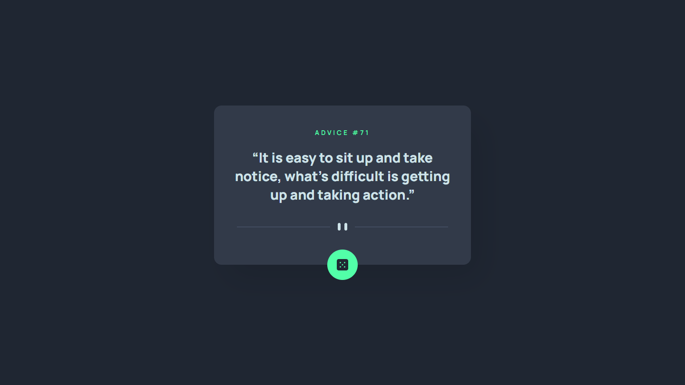

# Frontend Mentor - Advice generator app solution

This is a solution to the [Advice generator app challenge on Frontend Mentor](https://www.frontendmentor.io/challenges/advice-generator-app-QdUG-13db). Frontend Mentor challenges help you improve your coding skills by building realistic projects.

## Overview

### The challenge

Users should be able to:

- View the optimal layout for the app depending on their device's screen size
- See hover states for all interactive elements on the page
- Generate a new piece of advice by clicking the dice icon

### Screenshot

### Links

- Solution URL: [GitHub repository](https://github.com/Whiskydog/frontendmentor-advice-generator-app)
- Live Site URL: [GitHub Pages site](https://whiskydog.github.io/frontendmentor-advice-generator-app/)

## Built with

- Semantic HTML5 markup
- CSS custom properties
- Flexbox
- Mobile-first workflow
- [Vite.js](https://vitejs.dev/) - Frontend tooling
- [React](https://reactjs.org/) - JS library
- [react-spinners](https://github.com/davidhu2000/react-spinners) - React spinner library

## Author

- Website - [Whiskydog GitHub Pages site](https://whiskydog.github.io)
- Frontend Mentor - [@Whiskydog](https://www.frontendmentor.io/profile/Whiskydog)
- Twitter - [@whiskydog](https://www.twitter.com/whiskydog)